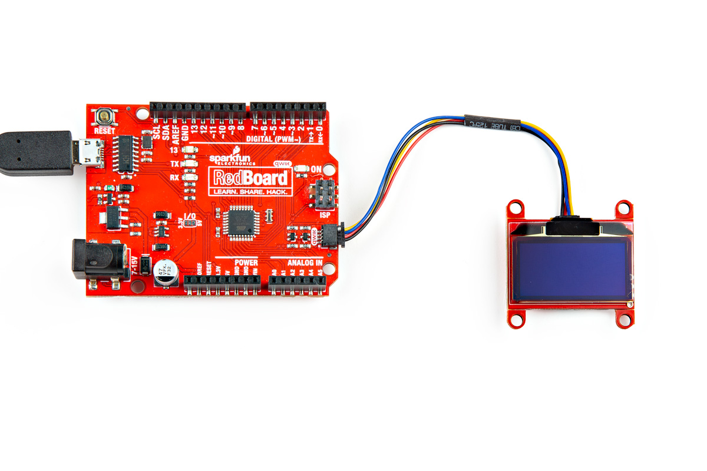

SparkFun's Qwiic system makes components plug and play. Simply plug one end of your Qwiic cable into the Qwiic connector on your OLED screen and the other end of the Qwiic cable into the controller board (here we're using the RedBoard Qwiic). Now connect your controller board to the computer and voila. You're ready to rock. 

<figure markdown>
[{ width="400" }](assets/img/23453-Qwiic-1_3_OLED-Action2.jpg "Click to enlarge")
<figcaption markdown>SparkFun Qwiic OLED connected to the SparkFun Qwiic RedBoard</figcaption>
</figure>
