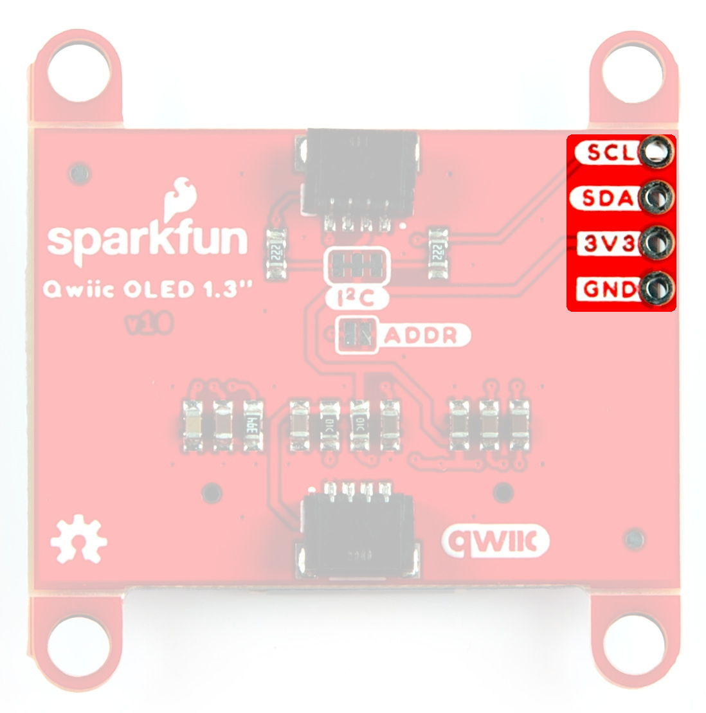
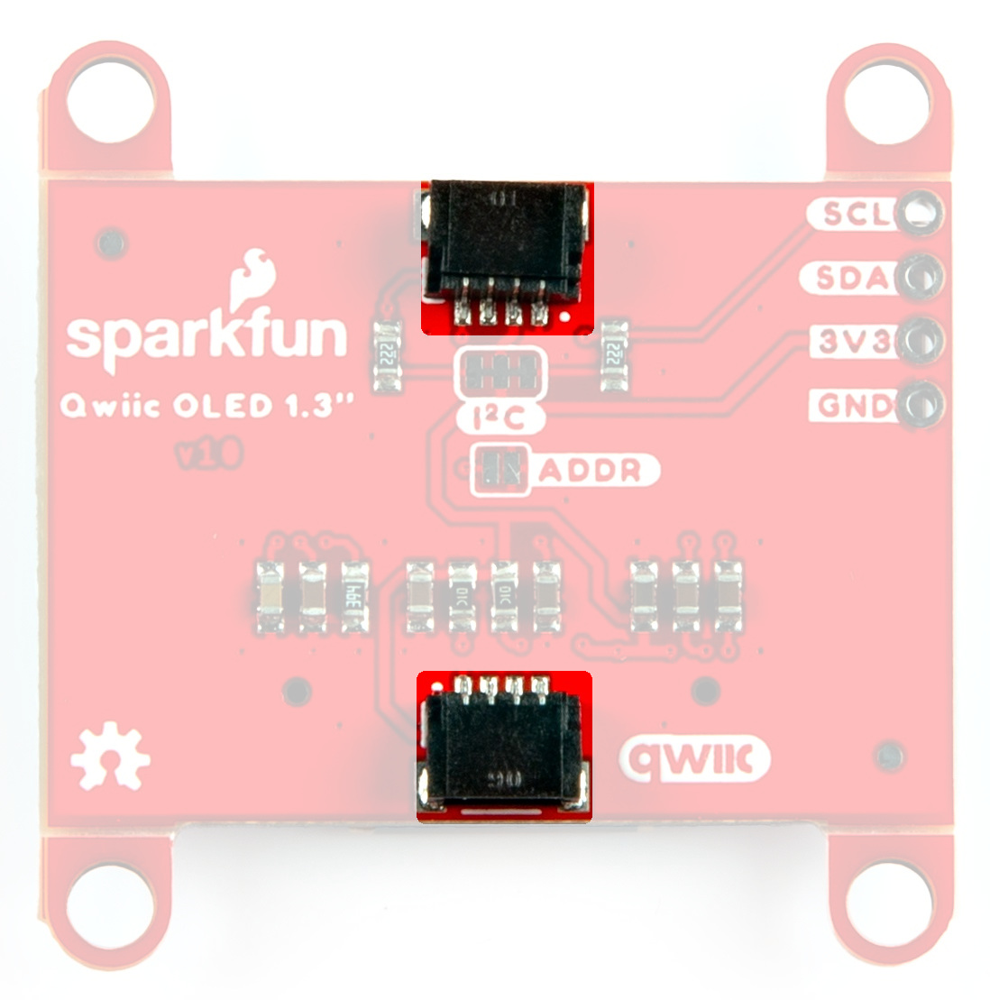
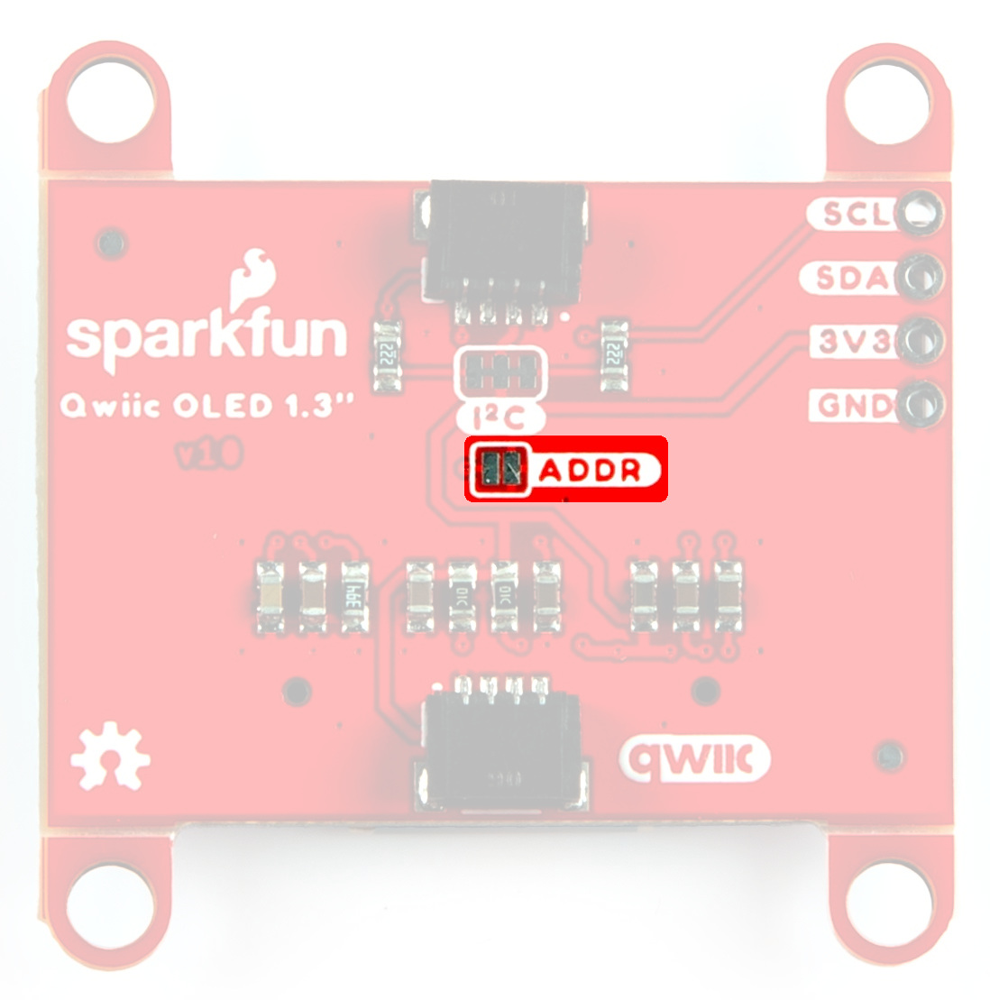
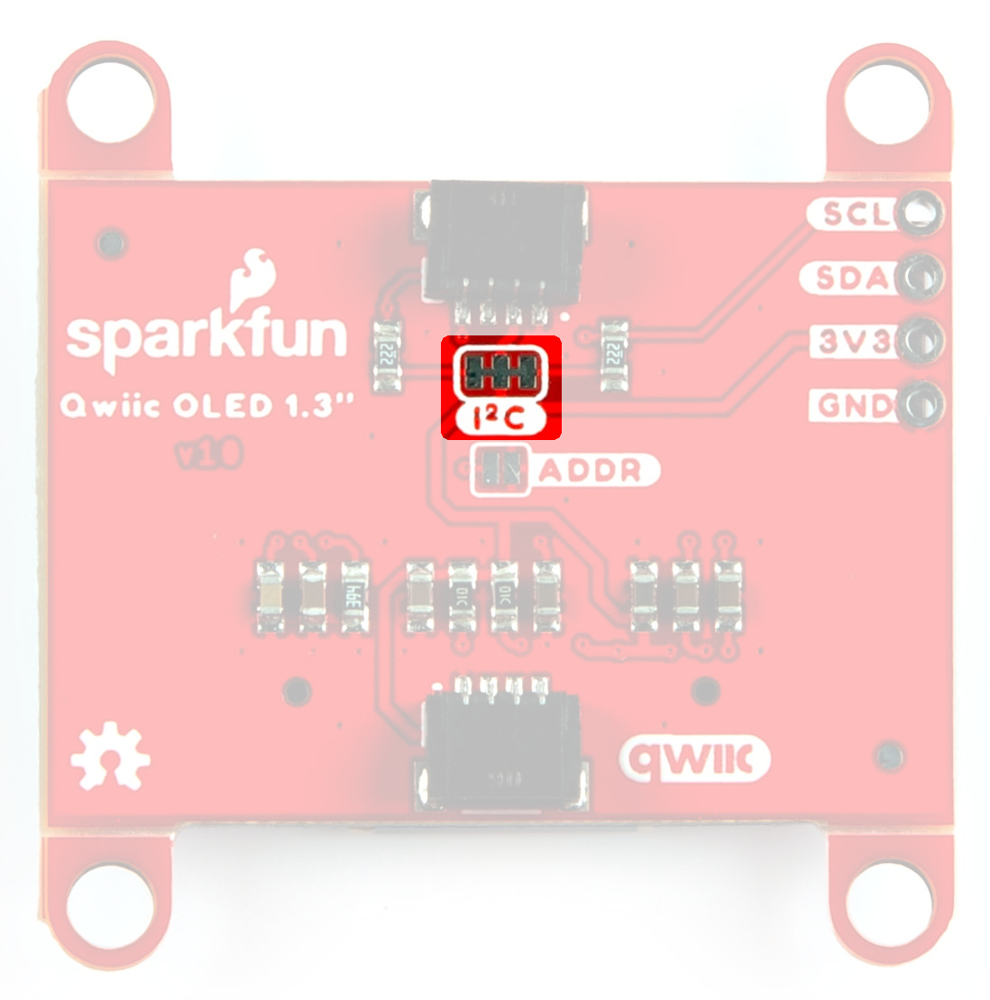
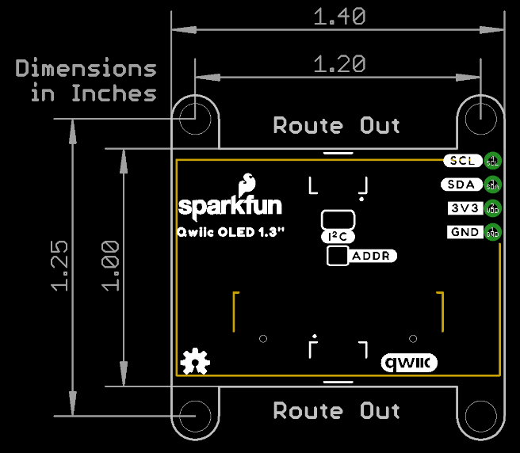

## OLED 

The OLED screen has a pixel resolution of 128 x 64, a panel size of 304.5 x 23.0 x 1.4 (mm), and an active area of 29.42 x 14.7 (mm). There is more information in the [datasheet](assets/board_files/1.3inch-SH1106-OLED_Datasheet.pdf).

<!--
<figure markdown>
[{ width="400" }](assets/img/22043-SparkFun-XBee-Explorer-USB-C-BuckConverter.jpg "Click to enlarge")
<figcaption markdown>OLED Screen</figcaption>
</figure>
-->

## Power

Ideally, power is supplied by the Qwiic connector, but the 3V3 and GND pins have been broken out to plated through holes on the side of the board (along with the Clock and Data Lines). Input voltage should not exceed <b>3.3V</v>, as there is no voltage regulation on this breakout. 

<figure markdown>
[{ width="400" }](assets/img/23453-Qwiic-OLED-IOPins.jpg "Click to enlarge")
<figcaption markdown>Power Options</figcaption>
</figure>

## Qwiic connectors

The board includes Qwiic connectors that provide power and I2C connectivity simultaneously.

For users that need to solder directly to the board, the pins are also broken out on the edge PTH. The I2C data and clock lines are also tied to 2.2kΩ pull-up resistors.

<figure markdown>
[{ width="400" }](assets/img/23453-Qwiic-OLED-QwiicConnex.jpg "Click to enlarge")
<figcaption markdown>Qwiic connectors</figcaption>
</figure>

## Jumpers

??? note "Never modified a jumper before?"
	Check out our <a href="https://learn.sparkfun.com/tutorials/664">Jumper Pads and PCB Traces tutorial</a> for a quick introduction!
	

		<a href="https://learn.sparkfun.com/tutorials/664">
		 
        How to Work with Jumper Pads and PCB Traces</a>
	

### Address Jumper

The SparkFun Qwiic OLED 1.3in board has a default I2C address of 0x3D, but by cutting the address jumper on the back of the board, you can select 0x3C. 

<figure markdown>
[{ width="400" }](assets/img/23453-Qwiic-OLED-ADDRJumper.jpg "Click to enlarge")
<figcaption markdown>Address Jumper</figcaption>
</figure>

### I2C Jumper

Like our other Qwiic boards, the SparkFun Qwiic OLED 1.3in comes equipped with pull-up resistors on the clock and data pins. If you are daisy-chaining multiple Qwiic devices, you will want to cut this jumper; if multiple sensors are connected to the bus with the pull-up resistors enabled, the parallel equivalent resistance will create too strong of a pull-up for the bus to operate correctly. As a general rule of thumb, disable all but one pair of pull-up resistors if multiple devices are connected to the bus. To disable the pull up resistors, use an X-acto knife to cut the joint between the jumper pads highlighted below.

<figure markdown>
[{ width="400" }](assets/img/23453-Qwiic-OLED-I2CJumper.jpg "Click to enlarge")
<figcaption markdown>I2C Jumper</figcaption>
</figure>

## Board Dimensions

The board dimensions are illustrated in the drawing below; the listed measurements are in inches.

<figure markdown>
[{ width="600" }](assets/board_files/SparkFun_Qwiic_OLED_1.3in_BoardDimensions.png "Click to enlarge")
<figcaption markdown>SparkFun Qwiic OLED 1.3in Board Dimensions</figcaption>
</figure>

??? tip "Need more measurements?"
	For more information about the board's dimensions, users can download the [Eagle files](assets/board_files/Qwiic_OLED_1.3in.zip) for the 1" x 1" board, or the [Eagle files](assets/board_files/Qwiic_OLED_1.3in.zip) for the Mini board. These files can be opened in Eagle and additional measurements can be made with the dimensions tool.

	??? info ":octicons-download-16:{ .heart } Eagle - Free Download!"
		Eagle is a [CAD]("computer-aided design") program for electronics that is free to use for hobbyists and students. However, it does require an account registration to utilize the software.

		

		[Download from :autodesk-primary:{ .autodesk }](https://www.autodesk.com/products/eagle/free-download "Go to downloads page"){ .md-button .md-button--primary width="250px" }
		

	
	??? info ":straight_ruler: Dimensions Tool"
		This video from Autodesk demonstrates how to utilize the dimensions tool in Eagle, to include additional measurements:

		

		

		<iframe src="https://www.youtube.com/embed/dZLNd1FtNB8" title="EAGLE Dimension Tool" frameborder="0" allow="accelerometer; autoplay; clipboard-write; encrypted-media; gyroscope; picture-in-picture" allowfullscreen></iframe>
		

		

